# Using Amazon Macie to detect Sensitive Data in S3 buckets

## Introduction

In this lab, you will use Amazon Macie to detect sensitive data inside our AWS Account. Macie applies machine learning and pattern matching techniques to identify and alert you to sensitive data, such as personally identifiable information (PII). 

This lab is set to Level 100, hence participants are **not required** to have any specific knowledge of AWS. The lab will take ~10-15 minutes to complete.

## Setup Logging into Cloud9

Before we begin, we'll need to setup our lab to ensure we have an S3 bucket with the right test data. To do this, we'll use AWS Cloud9.

AWS Cloud9 is a cloud-based integrated development environment (IDE) that lets you write and run code with just a browser. All code required to setup the lab is prepared, participants are only required to run the scripts in Cloud9.

To access Cloud9 search for `Cloud9` in the AWS Console and Click on Cloud9.
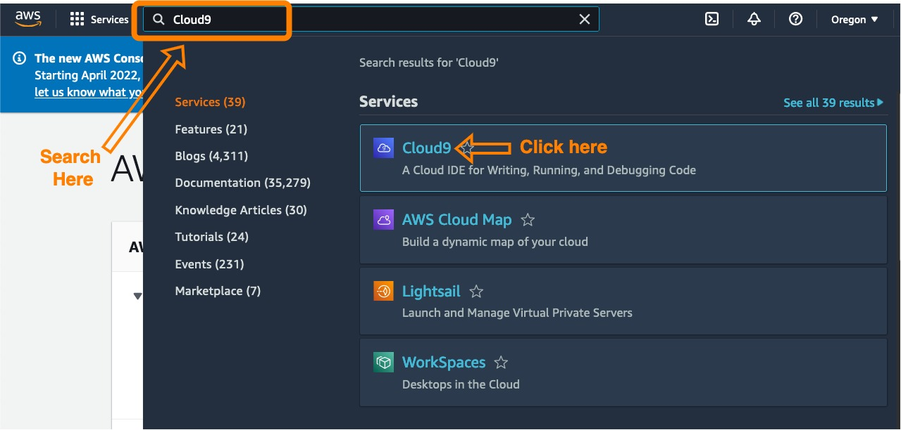

Then select the Cloud9 environment named `Macie Devlab (Level 100), and click the Open IDE button for you to enter the IDE

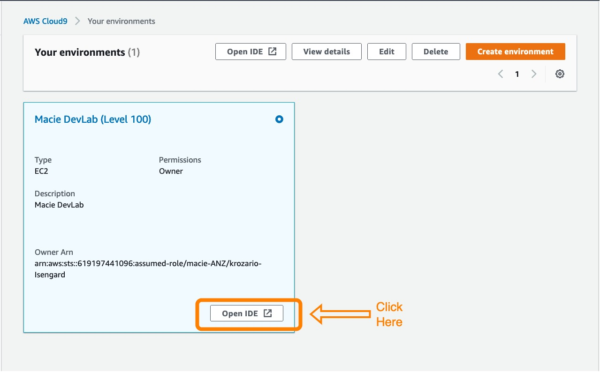

## Execute the startup script

Once inside Cloud9, we can begin the process of setting up our labs. 

Copy and paste the following code into the terminal of your Cloud9IDE (the terminal is at the bottom right of your screen), hit `enter` to execute the script.

*note: will change target github to official awslabs one once created*

    cd ~/environment && \
    rm -rf macie-ANZ-devlabs && \
    git clone https://github.com/keithrozario/macie-ANZ-devlabs.git --quiet && \
    cd macie-ANZ-devlabs && \
    pip3 install boto3 --quiet && \
    python3 setup_lab.py && \
    cd ~/environment

Once complete you should see a screen like below:

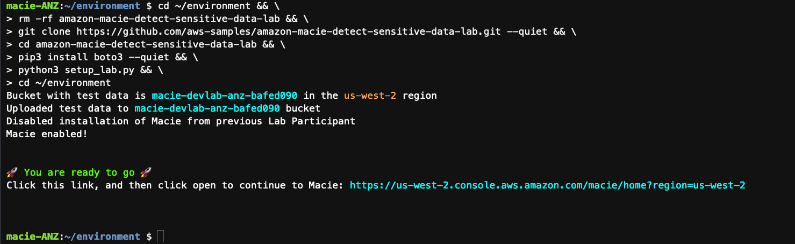

Congratulations, you're all done setting up the lab. You should now have a bucket in S3 prepopulated with test data from this repository (look under `test-data`).

You can click on the link present in your terminal to proceed to Macie. This will open Macie in a new browser tab, which will be useful as we'll come back to Cloud9 later.

## Running a Macie Job

Next we'll create a Macie Job, this job will analyze objects in any number of S3 buckets in this account to detect sensitive data.

To do this, select 'Get Started' and from then select Create Job under Analyze Buckets.

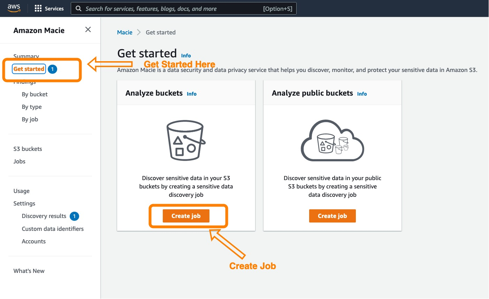

One the next screen, select 'Select specific buckets' to specify the bucket you wish to scan. And then select the bucket whose name begins with 'macie-devlab', this bucket has been prepopulated with test data for us to scan.

Once selected, click on 'Next'

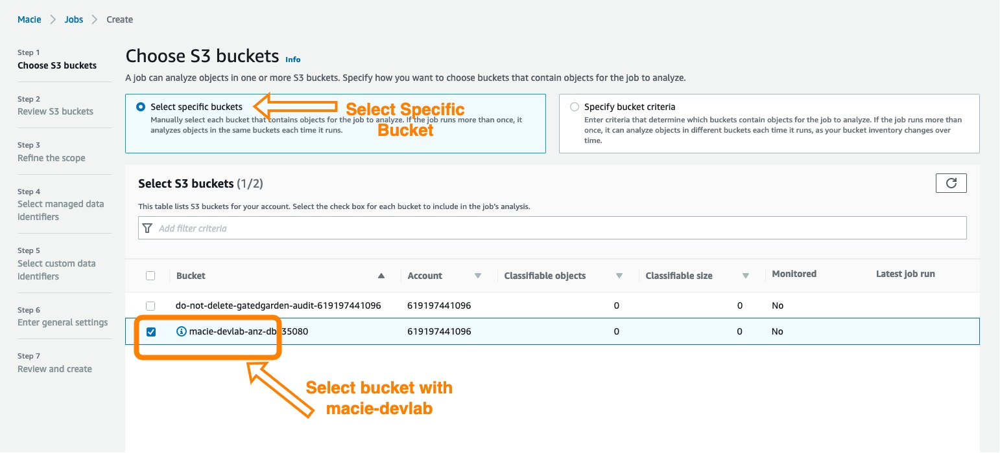

The next step is to review our buckets. You should see a single bucket with some estimated cost (the estimated cost might be $0.00). Click on Next.

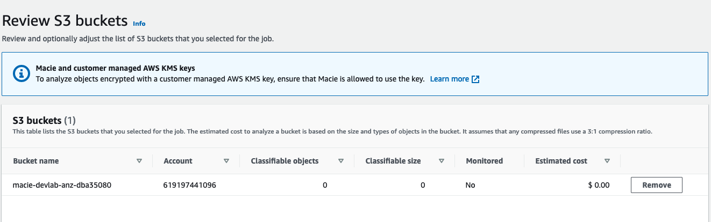

Next we'll need to refine the scope of our discovery job. For the purpose of this lab, we'll use a one-time job with 100% sampling depth. In your production environments, you might run daily jobs that scan only new objects. Similarly for very large buckets, e.g. buckets wih millions of objects, customers can choose a sampling depth to run analysis on a subset of the objects in the bucket.

For the purpose of the lab, the test data is small (<10 objects), so we'll run a one-time job with 100% sampling depth.

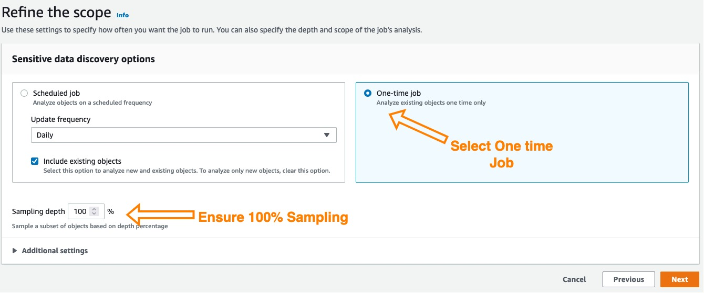

Now, we can select managed data identifiers. A set of built-in criteria and techniques that are designed to detect a specific type of sensitive data. Examples of sensitive data include credit card numbers, AWS secret access keys, or passport numbers for a particular country or region. These identifiers can detect a large and growing list of sensitive data types for many countries and regions. To view all the managed data identifiers, you can temporarily select the Include radio button. Just make sure you set the Selection type back to 'All' before proceeding to the next step.

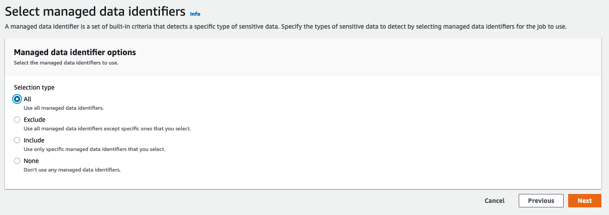

Additionaly we can also specify custom data identifiers to help Macie identify sensitive data outside of what is provided by the managed data identifiers. As part of the lab, we've pre-populated a custom data identifier called 'Gotham Passport Number', which will detect any data based on a regular expression we specified. Part of the test data will have one instance of this to demonstrate how Macie will analyze the finding.

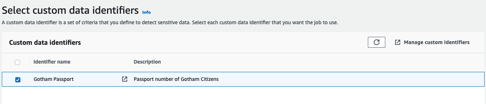

Now we'll enter a job name and optional description

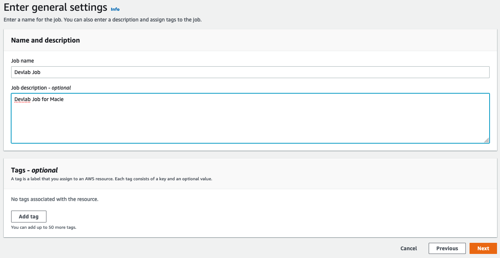

Finally we can review and hit submit. The job might not have any information on the bucket yet, and hence would estimate the cost to be $0.00, we can ignore this for now.

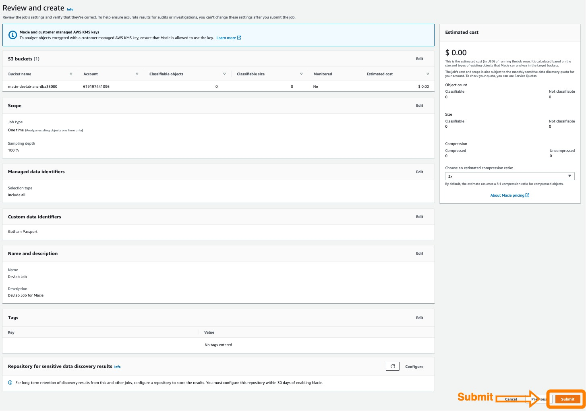

Congratulations, you've successfully initiated your first Macie Data Discovery Job. Macie is now analyzing data within the S3 bucket you specified to detect sensitive data, both based on the managed data identifiers, and the one custom data identifier we specified.

## Reviewing Test data

The Macie job will typically 5-10 minutes before completing. While we're waiting, let's use this time to analyze the test data in the bucket.

To do this, go back the Cloud9 IDE, and on the left side of the pane, you can select `macie-ANZ-devlabs/test-data`. You can also view the test data on this repo directly under the `test-data` directory. 

All test data is purely made up and do not reference any real person, phone number of credit card data.

## Reviewing Macie Finding

After about 5-10 minutes, findings should begin to appear in your Macie Console. Click on the findings to learn more about what sensitive data Macie discovered. To view the findings, click on the Findings link in the Macie menu:

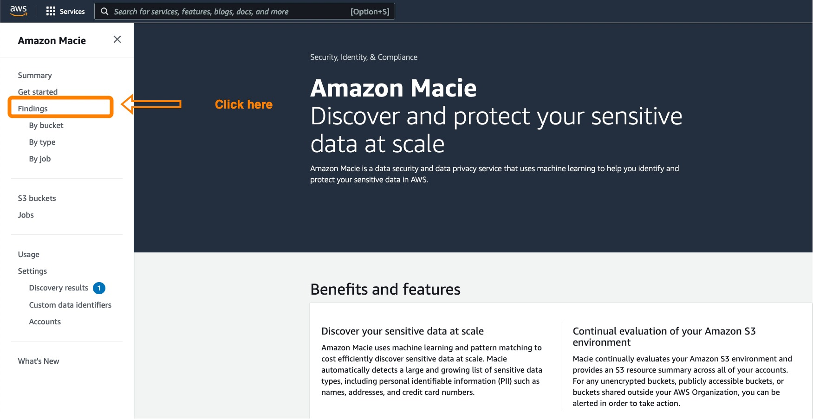

Clicking on each finding gives you an overview (see below), which describes Severity of the finding, and the resource (specific object in a specific bucket) that the finding is for. 

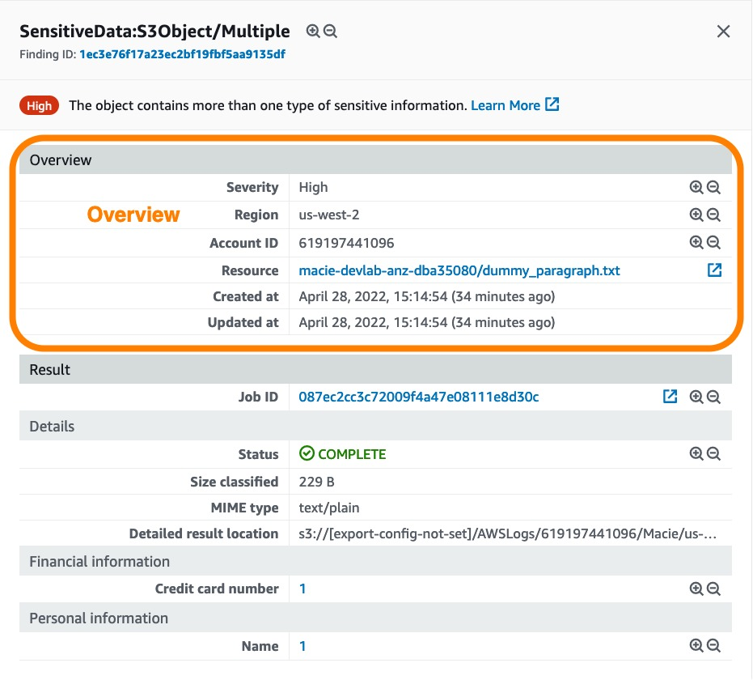

Each finding is for a specific resource (object in S3), and each finding can have multiple occurrences of different types of sensitive data. For instance in this finding we have 10 occurences of credit card data and 8 occurences of names. Clicking on the number we can see the location of those occurences in the object (which page,line,paragraph etc). 

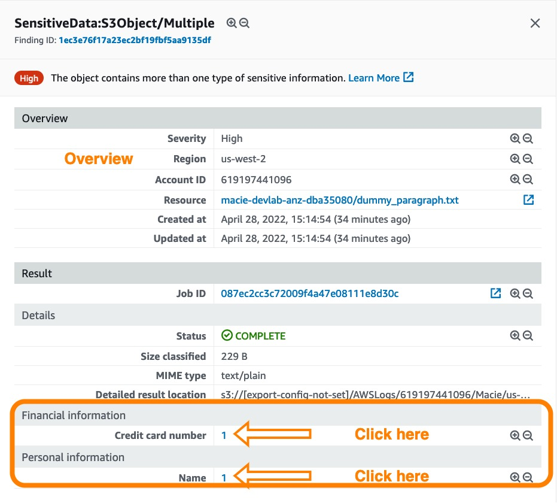

Macie will never publish the actual sensitive data, merely the location of that data. Some test data is also ignored. For example, in the `plastic_order.txt` file there is a credit card number that resulted in no findings. This is because we used a generic number that the credit card companies issue for testing such as this. Macie will explicitly ignore these numbers. For more information you can visit the Macie documentation [here](https://docs.aws.amazon.com/macie/latest/user/managed-data-identifiers.html).

Macie also uses a depth-first search algorithm to populate the job's findings with details about the location of 1–15 occurrences of sensitive data that Macie finds in the console. To access details about the location of as many as 1,000 occurrences of each type of sensitive data in an affected object, you can enable sensitive data discovery result for the findings which unfortunately isn't in scope for todays lab.

## Conclusion

In this lab, we used Macie to analyze test objects in an S3 bucket. We used manage data identifiers together with a custom data identifier based on a regular expression we specified. We then started the Macie Data Discovery Job, and finally reviewed the results.

As next steps, you might want to test Macie in your own environments using the same methods we walked through today, or test Macie with other test data you might think off.

# Survey Link

Thank you for participating in this lab. Please leave us feedback to let us know how we did and for us to improve in future labs. If the QR code below doesn't work, you can click on the link [here](https://eventbox.dev/survey/0BG8D0H).

## Security

See [CONTRIBUTING](CONTRIBUTING.md#security-issue-notifications) for more information.

## License

This library is licensed under the MIT-0 License. See the LICENSE file.